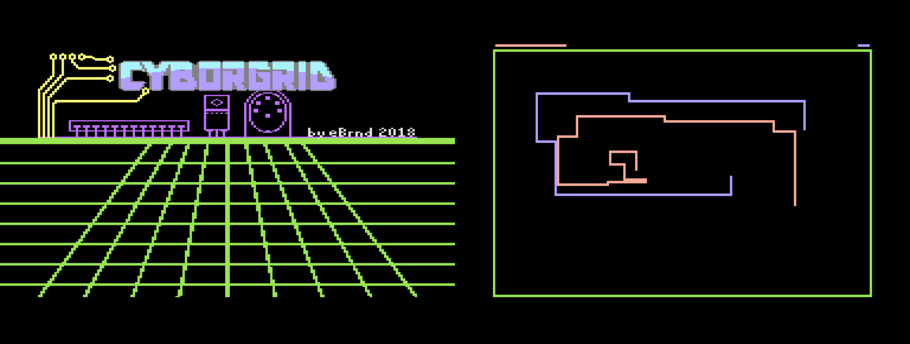

cyborgrid
=========

I made another Commodore 64 game.

How to Run
----------

You can download a .prg file from [the "releases" tab](https://github.com/eBrnd/cyborgrid/releases).

To play the game on a real C64, you need two joysticks connected to the controller ports.
Use your favorite means of transferring data to a C64, for instance an IEC2SD.
At the BASIC prompt, enter `LOAD"*",8`, and then `RUN`.

Press either of the fire buttons to quit the intro.
Then both players have to press their fire buttons at the same time to start the actual game.

If you want to play it on an emulator, I recommend using VICE.
On the Linux version, you can press F12 to get to the menu and configure your joysticks.

* dasm Assembler: http://dasm-dillon.sourceforge.net/
* cheesecutter: http://theyamo.kapsi.fi/ccutter/
  * I made the title screen music with this
  * Great tutorials on youtube: https://www.youtube.com/playlist?list=PLqMMxoX68R7JDbIZ2WJnOycQEBJpV1f3G
* Timanthes: http://csdb.dk/release/?id=75871
  * I made the static part of the title screen picture with this
